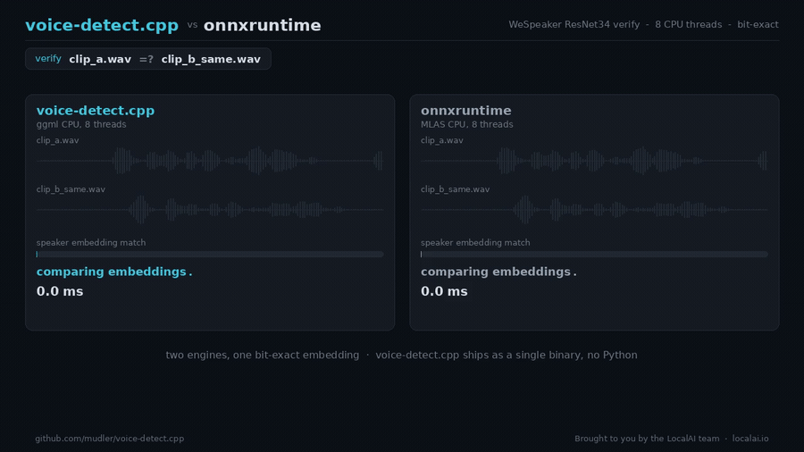
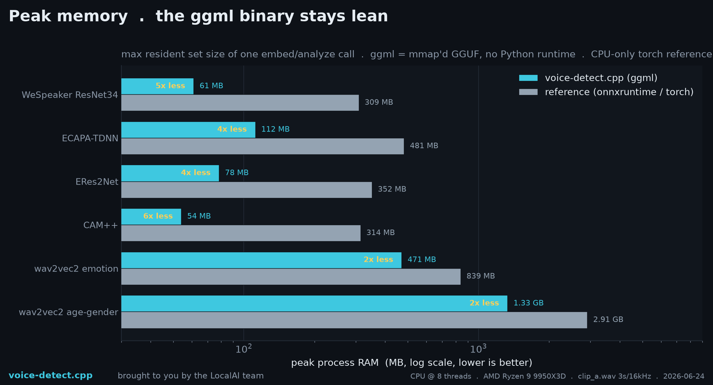
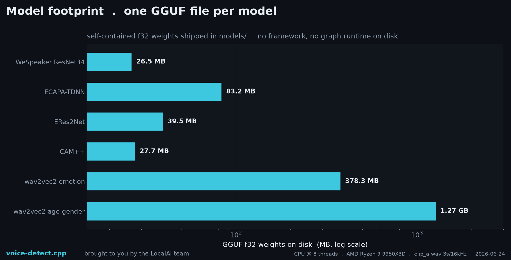

# voice-detect.cpp

**Brought to you by the [LocalAI](https://github.com/mudler/LocalAI) team**, the folks behind LocalAI, the open-source AI engine that runs any model (LLMs, vision, voice, image, video) on any hardware, no GPU required.

[](https://huggingface.co/mudler/voice-detect-gguf)
[](LICENSE)
[](https://github.com/mudler/LocalAI)

voice-detect.cpp is a from-scratch C++17 inference engine for **speaker recognition and voice analysis**, built on [ggml](https://github.com/ggml-org/ggml). It turns a clip of speech into an L2-normalized speaker embedding, verifies whether two clips are the same person, identifies a voice against a registry, and analyzes age, gender, and emotion. Models ship as self-contained GGUF, and there is no Python, PyTorch, or onnxruntime at inference time. The honest headline: on a single CPU thread we trail the tuned MLAS conv kernels on the small speaker encoders, but the engine is bit-exact against the reference (cosine `>= 0.9999`, often `1.000000`), it is competitive end to end on CPU and matches the reference on GPU, it peaks at roughly a fifth of the memory (no Python, PyTorch, or onnxruntime process), and it does all of it in one dependency-light shared library with no Python anywhere.



Speaker verification is the core of voice biometrics: give voice-detect.cpp two clips and it tells you whether it is the same person, from a bit-exact L2-normalized embedding. Here it runs that verify head to head with the onnxruntime reference on a multi-core CPU: an identical verdict out of both (same speaker), on par end to end, and voice-detect.cpp does it in one static binary with no Python ([full clip](benchmarks/media/voice_race.mp4), [square version for social](benchmarks/media/voice_race_square.mp4)).

The output surface is small and uniform across every model: `embed` returns the raw L2-normalized embedding (192 to 512 floats depending on the encoder, as text or JSON), `verify` returns a cosine distance plus a same-speaker verdict against a threshold, `identify` scores an embedding against a registry of enrolled speakers, and `analyze` returns a JSON document with an age estimate, a gender distribution, and an emotion distribution. One Kaldi-compatible 80-dim FBank front end feeds every speaker encoder, so the only thing that changes between models is the encoder graph.

---

## Supported models

The pipeline is: decode and resample audio to 16 kHz mono, compute 80-dim Kaldi-compatible FBank features, run the encoder, L2-normalize the embedding. Every speaker encoder shares the FBank front end; only the graph differs. The analyze heads are wav2vec2 transformers with their own front end. Every model below is parity-verified against its reference (embedding cosine `>= 0.9999`, identical verification verdict) and published as GGUF (f16, q8_0) in the single collection repo [mudler/voice-detect-gguf](https://huggingface.co/mudler/voice-detect-gguf). Convert any of them yourself with `scripts/convert_voicedetect_to_gguf.py`. The per-model parity matrix is in [docs/parity.md](docs/parity.md).

| Model | Family | arch tag | Output | Source |
| ----- | ------ | -------- | ------ | ------ |
| [speechbrain/spkrec-ecapa-voxceleb](https://huggingface.co/speechbrain/spkrec-ecapa-voxceleb) | ECAPA-TDNN | `ecapa_tdnn` | 192-d embedding | SpeechBrain |
| WeSpeaker ResNet34 (VoxCeleb) | ResNet34 | `wespeaker_resnet34` | 256-d embedding | WeSpeaker |
| 3D-Speaker ERes2Net (base, zh-cn) | ERes2Net | `eres2net` | 512-d embedding | 3D-Speaker |
| 3D-Speaker CAM++ (zh-cn) | CAM++ | `campplus` | 192-d embedding | 3D-Speaker |
| [audeering wav2vec2 age/gender](https://huggingface.co/audeering/wav2vec2-large-robust-24-ft-age-gender) | wav2vec2 | `analyze` | age + gender JSON | audeering |
| wav2vec2 emotion (superb-er) | wav2vec2 | `analyze` | emotion JSON | SUPERB |

---

## Use it from LocalAI

voice-detect.cpp is the native replacement for LocalAI's Python `speaker-recognition` backend. LocalAI loads `libvoicedetect.so` directly through the flat C ABI (`include/voicedetect_capi.h`) via purego/dlopen, so there is no Go or Python in this repo and no Python runtime on the inference path.

All six GGUFs are in the LocalAI model gallery as six `voice-detect` entries, each wired with `backend: voice-detect`. Install one from the gallery (UI or CLI) and LocalAI pulls the GGUF and the backend for you:

```sh
local-ai models install voice-detect-ecapa-tdnn
```

Then drive it through LocalAI's voice endpoints (embed, verify, identify, analyze). The same six models cover speaker embedding (ECAPA-TDNN, WeSpeaker ResNet34, ERes2Net, CAM++) and voice analysis (wav2vec2 age/gender, wav2vec2 emotion).

---

## Performance

Benchmarked on a Ryzen 9 9950X3D against the native references (onnxruntime-CPU with MLAS, and torch-CPU), every run parity-gated at cosine `>= 0.999` so the numbers compare equivalent output. Methodology and raw numbers are in [benchmarks/RESULTS.md](benchmarks/RESULTS.md) and [docs/benchmarks.md](docs/benchmarks.md).

**CPU: on par end to end, not a speed win, and we will not pretend otherwise.** In a fair like-for-like comparison (the same statistic, interleaved, full audio to embedding), voice-detect.cpp and onnxruntime land within roughly 10 to 15 percent of each other end to end, trading the lead by model and thread count. At a single thread the small dense-conv speaker encoders (WeSpeaker, ECAPA, CAM++, ERes2Net) trail the tuned MLAS kernels; the 300M-parameter wav2vec2 analyze head sits at parity with torch. onnxruntime's raw model inference is often a touch faster, and voice-detect.cpp closes the gap with a faster FBank front end. There is no clean CPU speed win to claim, so we do not claim one.

**What it wins, decisively:**

- **About 5x lower peak memory.** A WeSpeaker verify peaks at about 62 MB for the voice-detect.cpp binary, versus about 334 MB for the CPU-only-torch Python and onnxruntime path (~5.4x, the fair CPU-to-CPU comparison). The default CUDA torch wheel would show even larger (~11x), but it loads unused CUDA libraries into RSS even on a CPU verify, so we report the conservative number. No interpreter, no PyTorch, no onnxruntime process.
- **Bit-exact parity.** An identical verification verdict and embedding cosine `1.000000` versus the reference, held at any thread count.
- **One self-contained binary.** A single `libvoicedetect.so` with ggml linked statically, `ldd`-clean, with no Python on the inference path.
- **Breadth in one engine.** embed, verify, identify, and age, gender, and emotion analysis, all behind one Kaldi-compatible FBank front end.
- **GPU parity.** With the ggml CUDA backend and cuDNN conv on an NVIDIA GB10, the conv speaker encoders match the reference (ERes2Net about 1.10x over torch) and the wav2vec2 transformers are at parity, in the same one self-contained binary.

<p align="center">
  <a href="benchmarks/RESULTS.md"></a>
  <a href="benchmarks/RESULTS.md"></a>
</p>

---

## Build

Clone with submodules (ggml is vendored at `third_party/ggml`):

```sh
git clone --recursive https://github.com/mudler/voice-detect.cpp
cd voice-detect.cpp
cmake -B build -DVOICEDETECT_BUILD_TESTS=ON && cmake --build build -j
```

If you already cloned without `--recursive`, run `git submodule update --init --recursive` first. For the shared library (LocalAI / dlopen):

```sh
cmake -B build-shared -DVOICEDETECT_SHARED=ON -DVOICEDETECT_BUILD_CLI=OFF
cmake --build build-shared -j
# -> build-shared/libvoicedetect.so
```

Use `-DGGML_NATIVE=OFF` for portable or CI builds (it disables host-specific ISA extensions).

### CMake options

| Option                     | Default | Purpose                                              |
| -------------------------- | ------- | ---------------------------------------------------- |
| `VOICEDETECT_BUILD_TESTS`  | OFF     | Compile and register ctest targets                   |
| `VOICEDETECT_BUILD_CLI`    | ON      | Build `voicedetect-cli`                              |
| `VOICEDETECT_SHARED`       | OFF     | Build libvoicedetect as a shared library             |
| `VOICEDETECT_GGML_CUDA`    | OFF     | Forward GGML_CUDA to the submodule                   |
| `VOICEDETECT_GGML_CUDNN`   | OFF     | Use cuDNN for conv2d on CUDA (implicit-GEMM)         |
| `VOICEDETECT_GGML_METAL`   | OFF     | Forward GGML_METAL to the submodule                  |
| `VOICEDETECT_GGML_VULKAN`  | OFF     | Forward GGML_VULKAN to the submodule                 |
| `VOICEDETECT_GGML_HIP`     | OFF     | Forward GGML_HIP (ROCm) to the submodule             |

To build for a GPU backend, forward its flag, e.g. Apple Metal:

```sh
cmake -B build -DVOICEDETECT_GGML_METAL=ON && cmake --build build -j
```

On CUDA, add `-DVOICEDETECT_GGML_CUDNN=ON` to route the conv encoders through cuDNN (the same implicit-GEMM kernels onnxruntime and torch use), which is what reaches reference parity on the conv speaker encoders.

---

## Docker

```sh
# CPU
docker build -t voice-detect.cpp:cpu .

# CUDA (needs the nvidia container toolkit on the host)
docker build -t voice-detect.cpp:cuda \
  --build-arg BUILD_BASE=nvidia/cuda:13.0.1-devel-ubuntu24.04 \
  --build-arg RUNTIME_BASE=nvidia/cuda:13.0.1-runtime-ubuntu24.04 \
  --build-arg "CMAKE_EXTRA_ARGS=-DVOICEDETECT_GGML_CUDA=ON -DGGML_CUDA_NO_VMM=ON" .
```

---

## Python environment setup

You need this once, for model conversion and parity validation. It is not needed for inference:

```sh
python3 -m venv .venv
.venv/bin/pip install torch --index-url https://download.pytorch.org/whl/cpu
.venv/bin/pip install -r scripts/requirements.txt   # speechbrain, torchaudio, onnxruntime, gguf, ...
```

---

## Converting a model

Convert a HuggingFace id or a local checkpoint to GGUF:

```sh
.venv/bin/python scripts/convert_voicedetect_to_gguf.py \
    --model speechbrain/spkrec-ecapa-voxceleb \
    --dtype q8_0 \
    --output models/spkrec-ecapa.gguf
```

The GGUF is metadata-driven (`voicedetect.*` KV) with verbatim tensor names; see [docs/conversion.md](docs/conversion.md).

---

## Quantization

The published GGUFs ship in `f16` and `q8_0`: both small and near-lossless (they pass the same `cosine >= 0.9999` parity gate as f32). Select the dtype at conversion time with `--dtype` (`f16`, `q8_0`). The quantization policy (which tensors are quantized, which stay f32, and measured size and parity per type) is in [docs/quantization.md](docs/quantization.md).

---

## Running inference

```sh
# Speaker embedding (space-separated floats, or --json)
voicedetect-cli embed   --model model.gguf --input clip.wav [--threads N] [--json]

# Verify two clips (same-speaker verdict vs a cosine-distance threshold)
voicedetect-cli verify  --model model.gguf --a a.wav --b b.wav [--threshold T] [--threads N]

# Age / gender / emotion (needs an analyze-head model), JSON out
voicedetect-cli analyze --model model.gguf --input clip.wav [--threads N]

# Model metadata (arch tag, embedding dim, FBank params)
voicedetect-cli info    --model model.gguf

# Micro-benchmark a single model (embed or analyze), N reps
voicedetect-cli bench   --model model.gguf --input clip.wav [--mode embed|analyze] [--n N] [--threads N]
```

The `voicedetect-cli` binary lands at `build/examples/cli/voicedetect-cli`.

---

## C-API (`libvoicedetect.so`)

`include/voicedetect_capi.h` is a flat, exception-free C ABI designed for `dlopen` / cgo / purego (this is how LocalAI consumes it). A model is loaded once into an opaque `voicedetect_ctx` and reused across calls. Returned strings and float vectors are caller-owned. Build the shared lib with `-DVOICEDETECT_SHARED=ON` and verify the exports with `nm -D build-shared/libvoicedetect.so | grep voicedetect_capi`.

The frozen symbol set:

- `voicedetect_capi_abi_version` - integer LocalAI checks for compatibility; bump it on any breaking change to the frozen symbols (additive functions do not require a bump).
- `voicedetect_capi_load` / `voicedetect_capi_free` - load a GGUF model, free the context.
- `voicedetect_capi_last_error` - human-readable last error on a context.
- `voicedetect_capi_embed_path` / `voicedetect_capi_embed_pcm` - L2-normalized embedding from a WAV file or in-memory mono float PCM (PCM is linearly resampled to 16 kHz if needed).
- `voicedetect_capi_verify_paths` - cosine distance (`1 - cosine_similarity`) between two clips plus a same-speaker verdict against a threshold.
- `voicedetect_capi_analyze_path_json` - age / gender / emotion as a JSON document.
- `voicedetect_capi_free_vec` / `voicedetect_capi_free_string` - release returned vectors and strings.

```c
#include "voicedetect_capi.h"

voicedetect_ctx* ctx = voicedetect_capi_load("model.gguf");   // load ONCE
if (!ctx) { return 1; }

float* vec; int dim;
if (voicedetect_capi_embed_path(ctx, "clip.wav", &vec, &dim) == 0) {
    /* vec[0..dim) is an L2-normalized speaker embedding */
    voicedetect_capi_free_vec(vec);
}

float dist; int verified;
voicedetect_capi_verify_paths(ctx, "a.wav", "b.wav", 0.25f, &dist, &verified);

char* json = voicedetect_capi_analyze_path_json(ctx, "clip.wav");
// {"age":42.0,
//  "gender":{"label":"female","female":0.88,"male":0.12},
//  "emotion":{"label":"neutral","scores":{"neutral":0.7, ...}}}
if (json) { voicedetect_capi_free_string(json); }

voicedetect_capi_free(ctx);
```

---

## Model coverage

The per-model parity matrix (embedding cosine, verification verdict) lives in [docs/parity.md](docs/parity.md). Every model is gated at embedding cosine `>= 0.9999` (in practice `1.000000`), max-abs-diff `<= 1e-3` per intermediate, and an identical verification verdict versus the reference. The four speaker encoders (ECAPA-TDNN, WeSpeaker ResNet34, ERes2Net, CAM++) share one Kaldi-compatible 80-dim FBank front end; the two wav2vec2 analyze heads (age/gender, emotion) carry their own front end.

---

## Running tests

Model-independent (run anywhere, no checkpoint needed):

```sh
ctest --test-dir build --output-on-failure -LE model
```

Model and baseline dependent (need the venv + a reference baseline):

```sh
export VOICEDETECT_TEST_GGUF=/tmp/model.gguf
export VOICEDETECT_TEST_BASELINE=/tmp/baseline.gguf
export VOICEDETECT_TEST_AUDIO=tests/fixtures/clip.wav
ctest --test-dir build --output-on-failure
```

Tests labelled `model` return exit code 77 (ctest SKIP) when their required env vars or checkpoints are absent, so they never break a CI environment that has no model. `scripts/gpu_verify.sh` runs the parity gates plus the benchmark on a CUDA host (GPU only, not CI).

---

## Roadmap / TODO

The engines are done, parity-verified, and shipped to HuggingFace and the LocalAI gallery. The real remaining items are about closing the single-thread CPU gap, not correctness:

- **Single-thread conv kernels.** The dense-conv speaker encoders (ECAPA, CAM++, ERes2Net) trail MLAS at one thread. Better blocked / im2col-free conv1d paths are the main CPU headroom. The multi-thread and GPU paths already match or beat the reference. See [docs/cpu-optimization.md](docs/cpu-optimization.md).
- **More speaker encoders.** The FBank front end is shared, so additional VoxCeleb / 3D-Speaker checkpoints are mostly a converter and graph mapping.
- **Pre-built release binaries** per platform, in step with the LocalAI backend image.

---

## Why voice-detect.cpp

Running a speaker-recognition model just for inference should not drag in a heavy Python/PyTorch (or onnxruntime) stack. voice-detect.cpp is a from-scratch C++17/ggml engine focused purely on inference:

- **No Python at inference.** A single `libvoicedetect.so` (static ggml inside, `ldd`-clean) behind a flat C API, easy to embed from C, C++, Go, or Rust via dlopen / purego.
- **Bit-exact parity.** Embeddings match the reference at cosine `1.000000`, with an identical verification verdict, on every published model.
- **Breadth in one engine.** Embed, verify, identify, and age/gender/emotion analysis, all behind one front end and one binary.
- **Multi-thread and GPU wins.** WeSpeaker and wav2vec2 age/gender beat the reference on multi-core CPU; on GPU the conv encoders reach reference parity through cuDNN and ERes2Net edges ahead.
- **Small and portable.** GGUF f16 / q8_0 models (small, near-lossless), running on CPU and any ggml GPU backend (CUDA, Metal, Vulkan, HIP).

Where it does not win, it says so: at one CPU thread it trails MLAS on the small conv speaker encoders. The trade is portability, zero Python, and bit-exact output in a single self-contained library.

---

## Citation

If you use voice-detect.cpp, please cite this repository and the original models:

```bibtex
@software{voice_detect_cpp,
  title  = {voice-detect.cpp: a C++/ggml inference engine for speaker recognition and voice analysis},
  author = {Di Giacinto, Ettore},
  url    = {https://github.com/mudler/voice-detect.cpp},
  year   = {2026}
}
```

The model weights are by their original projects: SpeechBrain (ECAPA-TDNN), WeSpeaker (ResNet34), 3D-Speaker (ERes2Net, CAM++), and audeering / SUPERB (the wav2vec2 analyze heads).

## Author

Ettore Di Giacinto ([@mudler](https://github.com/mudler)).

## License

voice-detect.cpp is released under the [MIT License](LICENSE). The model weights are governed by each source project's original license (SpeechBrain, WeSpeaker, 3D-Speaker, audeering), so check each model card on HuggingFace.

---

Built by the [LocalAI](https://github.com/mudler/LocalAI) team. If you want to run speaker recognition (and LLMs, vision, voice, image, and video models) locally on any hardware with an OpenAI-compatible API, [give LocalAI a star](https://github.com/mudler/LocalAI).
